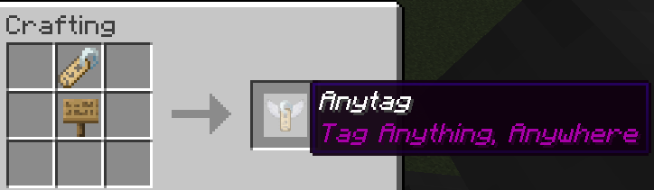

# *Anytag* Datapack (Tag Anything, Anywhere)

Have you ever wanted to place **name tags** on anything? Now you can! `Anytag` is a Minecraft Datapack which allows players to craft a special *Anytag* item through a simple recipe. The item is used so any player can right-click on any block with the item in their hand, which will then place flying text where the player is pointing at and simultaneously consume itself. 

## Crafting

The recipe for crafting the *Anytag* item is simple. You just need a name tag and a sign of any kind (Dark oak sign, Oak sign, Spruce sign, etc.) and place them in this order:

You can rename the *Anytag* item according to your desires.

## Usage

Here is a short depiction of how the *Anytag* item is crafted and used:

**Right-clicking** the *Anytag* item on any block will place flying text with the custom name of *Anytag* item. 

**Right-clicking** in the middle of flying text will remove the text and drop the previously used *Anytag* item.

**Left-clicking** in the middle of flying text will remove the text and drop the *name tag* item instead of the *Anytag* item.

## TODO 

- FIX maybe: when the *Anytag* item is being shot out from a dispenser